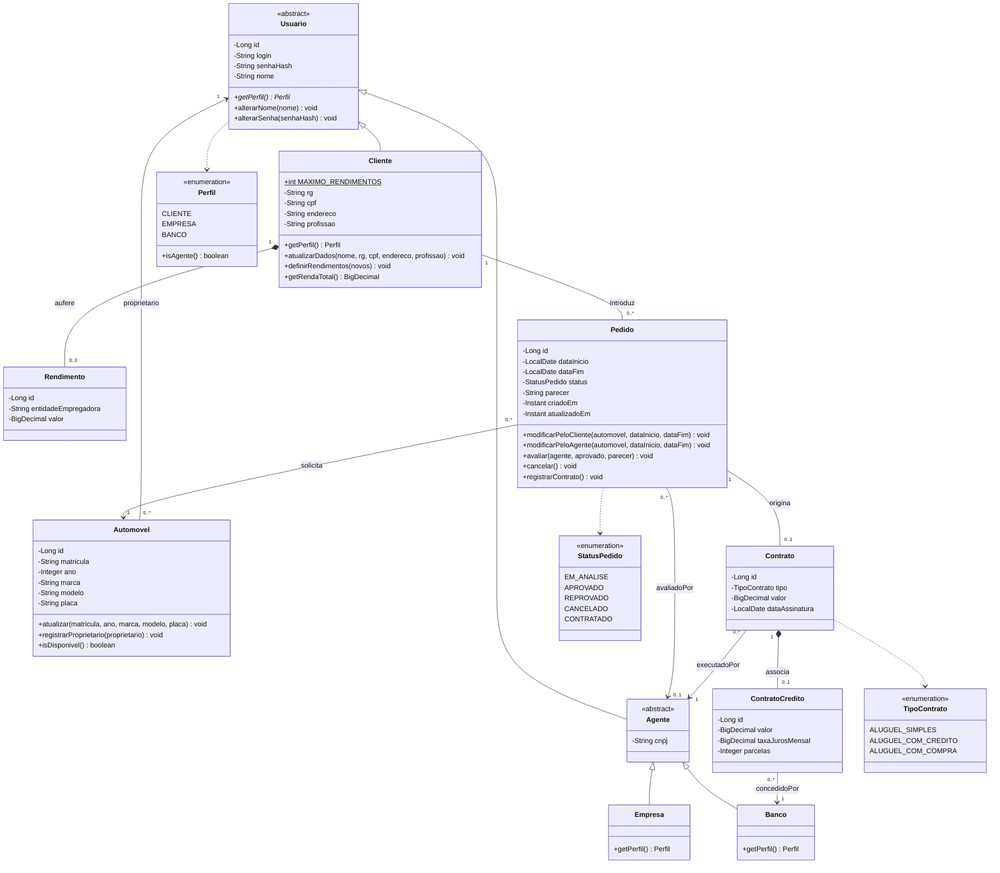

# Diagrama de Classes

```mermaid
classDiagram
    direction TB

    class Usuario {
        <<abstract>>
        -Long id
        -String login
        -String senhaHash
        -String nome
        +getPerfil()* Perfil
        +alterarNome(nome) void
        +alterarSenha(senhaHash) void
    }
    class Cliente {
        +int MAXIMO_RENDIMENTOS$
        -String rg
        -String cpf
        -String endereco
        -String profissao
        +getPerfil() Perfil
        +atualizarDados(nome, rg, cpf, endereco, profissao) void
        +definirRendimentos(novos) void
        +getRendaTotal() BigDecimal
    }
    class Rendimento {
        -Long id
        -String entidadeEmpregadora
        -BigDecimal valor
    }
    class Agente {
        <<abstract>>
        -String cnpj
    }
    class Empresa {
        +getPerfil() Perfil
    }
    class Banco {
        +getPerfil() Perfil
    }
    class Automovel {
        -Long id
        -String matricula
        -Integer ano
        -String marca
        -String modelo
        -String placa
        +atualizar(matricula, ano, marca, modelo, placa) void
        +registrarProprietario(proprietario) void
        +isDisponivel() boolean
    }
    class Pedido {
        -Long id
        -LocalDate dataInicio
        -LocalDate dataFim
        -StatusPedido status
        -String parecer
        -Instant criadoEm
        -Instant atualizadoEm
        +modificarPeloCliente(automovel, dataInicio, dataFim) void
        +modificarPeloAgente(automovel, dataInicio, dataFim) void
        +avaliar(agente, aprovado, parecer) void
        +cancelar() void
        +registrarContrato() void
    }
    class Contrato {
        -Long id
        -TipoContrato tipo
        -BigDecimal valor
        -LocalDate dataAssinatura
    }
    class ContratoCredito {
        -Long id
        -BigDecimal valor
        -BigDecimal taxaJurosMensal
        -Integer parcelas
    }
    class Perfil {
        <<enumeration>>
        CLIENTE
        EMPRESA
        BANCO
        +isAgente() boolean
    }
    class StatusPedido {
        <<enumeration>>
        EM_ANALISE
        APROVADO
        REPROVADO
        CANCELADO
        CONTRATADO
    }
    class TipoContrato {
        <<enumeration>>
        ALUGUEL_SIMPLES
        ALUGUEL_COM_CREDITO
        ALUGUEL_COM_COMPRA
    }

    Usuario <|-- Cliente
    Usuario <|-- Agente
    Agente <|-- Empresa
    Agente <|-- Banco
    Cliente "1" *-- "0..3" Rendimento : aufere
    Cliente "1" -- "0..*" Pedido : introduz
    Pedido "0..*" --> "1" Automovel : solicita
    Pedido "0..*" --> "0..1" Agente : avaliadoPor
    Automovel "0..*" --> "1" Usuario : proprietario
    Pedido "1" -- "0..1" Contrato : origina
    Contrato "0..*" --> "1" Agente : executadoPor
    Contrato "1" *-- "0..1" ContratoCredito : associa
    ContratoCredito "0..*" --> "1" Banco : concedidoPor
    Usuario ..> Perfil
    Pedido ..> StatusPedido
    Contrato ..> TipoContrato
```
