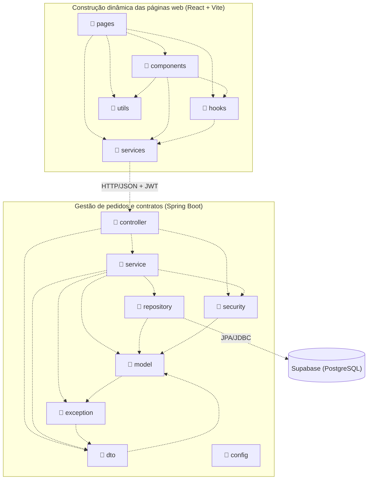

# Diagrama de Pacotes (Visão Lógica)

```mermaid
flowchart TB
    subgraph Web["Construção dinâmica das páginas web (React + Vite)"]
        FPages["📁 pages"]
        FComponents["📁 components"]
        FHooks["📁 hooks"]
        FServices["📁 services"]
        FUtils["📁 utils"]
    end

    subgraph Gestao["Gestão de pedidos e contratos (Spring Boot)"]
        Controller["📁 controller"]
        Service["📁 service"]
        Repository["📁 repository"]
        Model["📁 model"]
        Dto["📁 dto"]
        Security["📁 security"]
        Config["📁 config"]
        Exception["📁 exception"]
    end

    Supabase[("Supabase (PostgreSQL)")]

    FPages -.-> FComponents
    FPages -.-> FHooks
    FPages -.-> FServices
    FPages -.-> FUtils
    FComponents -.-> FHooks
    FComponents -.-> FServices
    FComponents -.-> FUtils
    FHooks -.-> FServices

    FServices -. "HTTP/JSON + JWT" .-> Controller

    Controller -.-> Service
    Controller -.-> Dto
    Controller -.-> Security
    Service -.-> Repository
    Service -.-> Model
    Service -.-> Dto
    Service -.-> Security
    Service -.-> Exception
    Repository -.-> Model
    Dto -.-> Model
    Security -.-> Model
    Model -.-> Exception
    Exception -.-> Dto
    Repository -. "JPA/JDBC" .-> Supabase
```
